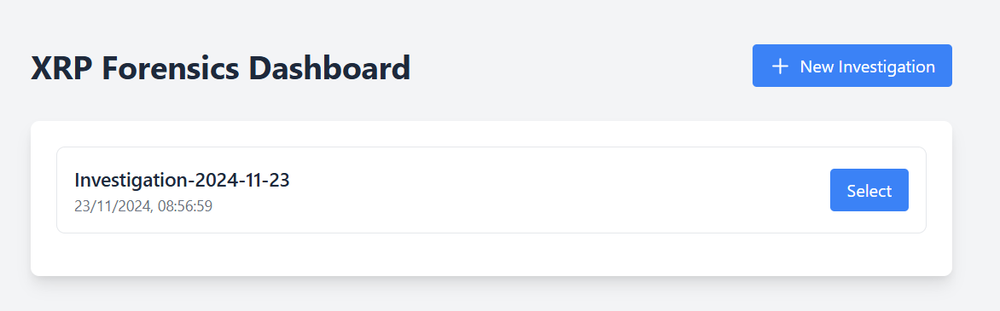
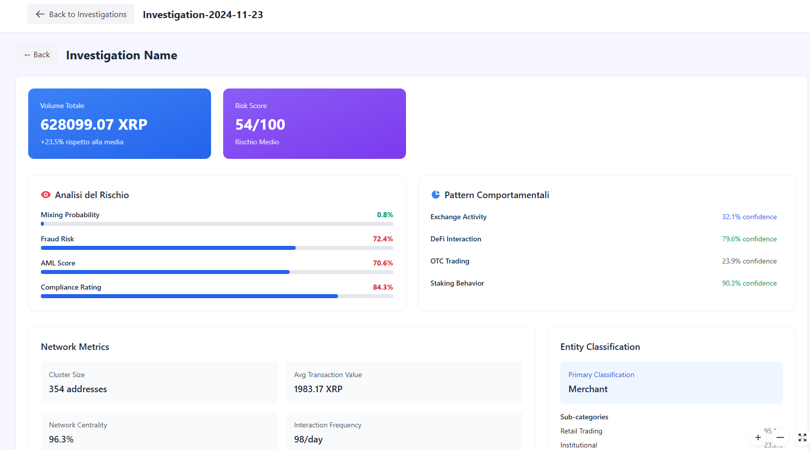
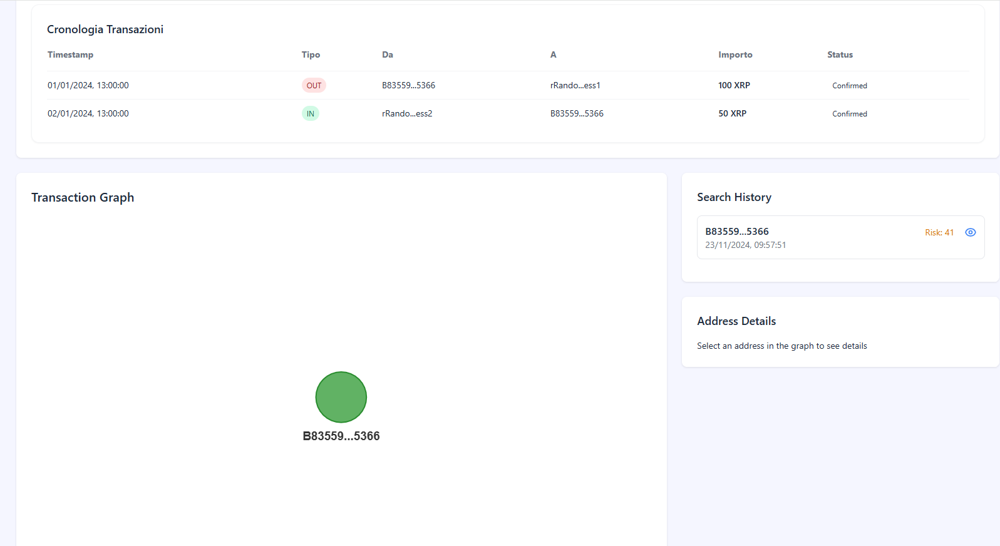
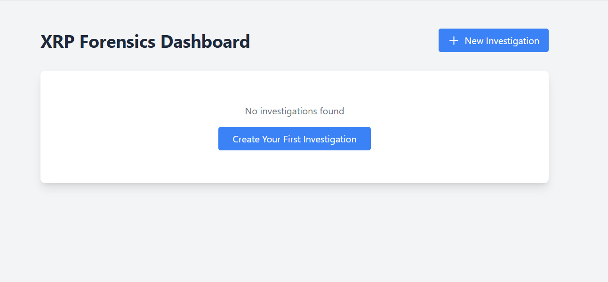

# XRPolice

An interactive dashboard for XRP transaction forensic analysis, enabling tracking and analysis of movements on the XRP Ledger blockchain.



## 🚀 Key Features

### 📊 Detailed Analysis
- Complete transaction tracking
- Graphical visualization of address connections
- Advanced network metrics
- Behavioral patterns
- Entity classification

### 🔍 Advanced Investigation


- **Total Volume**: XRP flow monitoring
- **Risk Score**: Risk assessment on a 0-100 scale
- **Risk Analysis**: 
  - Mixing Probability
  - Fraud Risk
  - AML Score
  - Compliance Rating

### 🌐 Network Analysis


- Graphical transaction visualization
- Network centrality metrics
- Cluster size
- Interaction frequency

### 📈 Behavioral Patterns
- Exchange Activity
- DeFi Interaction
- OTC Trading
- Staking Behavior

## 💼 Entity Classification
- Primary address classification
- Detailed subcategories
- Confidence metrics for each classification

## 📱 Interface


- Modern and intuitive design
- Simplified navigation
- Transaction timeline
- Search history

## 🛠 Technical Features
- Real-time tracking
- Cluster analysis
- Risk calculation
- Address blacklisting
- Data export

## 🔒 Security
- Suspicious activity monitoring
- Real-time risk assessment
- Anti-fraud scoring system

## 📊 Key Metrics
- Network Centrality
- Cluster Size
- Transaction Volume
- Risk Scoring
- Interaction Frequency

## 🚀 Getting Started

1. Click "New Investigation" to start a new analysis
2. Enter the XRP address to analyze
3. Explore the transaction graph
4. Analyze behavioral patterns
5. Evaluate risk score and network metrics

## 📝 Notes
- System is continuously updated
- Analyses are based on on-chain data
- Risk score is calculated using multiple parameters

## 🤝 Contributing
We welcome contributions and suggestions to improve the platform.

## 📄 License
[Insert license type]

## 🔧 Technical Requirements
- Node.js
- React
- Vis.js for network visualization
- Tailwind CSS for styling

## 🌐 API Integration
- XRP Ledger API
- Custom risk scoring API
- Entity classification service

## 💻 Installation

```bash
# Clone the repository
git clone https://github.com/yourusername/xrp-forensics-dashboard.git

# Install dependencies
npm install

# Run the development server
npm run dev

# Build for production
npm run build
```

## 🔐 Environment Variables

Create a `.env` file in the root directory:

```env
API_KEY=your_api_key
API_URL=your_api_url
```

## 📚 Documentation
For detailed documentation, please visit [documentation link]

## 🤝 Support
For support, please email [support email]

## 🔄 Updates
The dashboard is regularly updated with new features and improvements. Check the changelog for recent updates.
